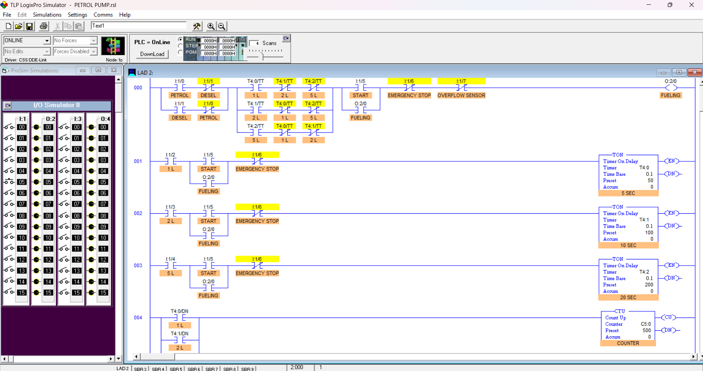
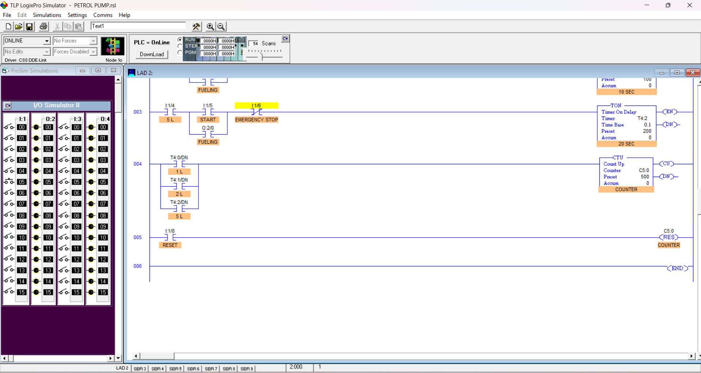

# PLC-Based Petrol Pump Control System

A PLC-based petrol pump control system developed and simulated using Ladder Logic and TLP LogixPro. The project demonstrates industrial automation concepts including fuel selection, quantity selection, timer-based dispensing, safety interlocks, and customer counting.

## Project Overview

The system simulates the control logic of a petrol pump. The operator can select either Petrol or Diesel and choose a dispensing quantity of 1 L, 2 L, or 5 L. After pressing START, the pump operates for the selected dispensing duration using PLC timers.

The system also includes Emergency Stop and Overflow Sensor protection to stop the pump during unsafe conditions.

## Features

- Petrol/Diesel fuel selection
- 1 L, 2 L and 5 L quantity selection
- XOR-based selection validation
- START control with pump holding logic
- TON timer-based fuel dispensing
- Automatic stopping after the selected dispensing time
- Emergency Stop protection
- Overflow Sensor protection
- CTU-based customer counter
- Counter Reset for the next customer

## PLC I/O Configuration

| Address | Function |
|---|---|
| I:1/0 | Petrol Selection |
| I:1/1 | Diesel Selection |
| I:1/2 | 1 L Selection |
| I:1/3 | 2 L Selection |
| I:1/4 | 5 L Selection |
| I:1/5 | START |
| I:1/6 | Emergency Stop |
| I:1/7 | Overflow Sensor |
| I:1/8 | Counter Reset |
| O:2/0 | Pump Motor |

## Timer Configuration

| Timer | Selection | Preset | Approx. Time |
|---|---|---:|---:|
| T4:0 | 1 L | 100 | 10 seconds |
| T4:1 | 2 L | 200 | 20 seconds |
| T4:2 | 5 L | 500 | 50 seconds |

The timers use a 0.1-second time base.

## Customer Counter

A CTU counter (C5:0) records completed dispensing operations. The counter increments when the selected dispensing timer reaches its Done state.

A RESET input is provided to reset the customer counter to zero.

## Safety Features

### Emergency Stop
The Emergency Stop input interrupts pump operation immediately when activated.

### Overflow Sensor
The Overflow Sensor provides an additional safety condition to stop the pump when an overflow condition is detected.

## Working Principle

1. Select Petrol or Diesel.
2. Select the required quantity: 1 L, 2 L or 5 L.
3. The ladder logic validates the selections.
4. Press START to activate the pump.
5. The corresponding TON timer begins timing.
6. The pump stops when the selected timer reaches its preset value.
7. The CTU counter records the completed dispensing operation.
8. Emergency Stop or Overflow Sensor activation stops the pump for safety.
9. The counter can be reset for the next customer.

## Ladder Diagram

### Main Ladder Diagram

### Timer, Counter and Reset Logic

## Tools Used

- TLP LogixPro
- PLC Ladder Logic
- TON Timers
- CTU Counter

## Project Documentation

- [Project Documentation](PLC_Petrol_Pump_Project_Documentation.pdf)
- [Project Presentation](PLC_PETROL_PUMP.pptx)

## Learning Outcomes

This project provided practical experience in PLC ladder logic, timer and counter instructions, selection logic, safety interlocks, and industrial automation control sequences.

## Limitations

This project is a simulation and does not control an actual fuel dispensing system. It does not include real fuel-flow measurement, billing, HMI integration, or physical pump hardware.

## Future Improvements

Possible future improvements include:

- HMI-based operator interface
- Real-time fuel flow measurement
- Fuel price and billing calculation
- PLC-to-HMI communication
- Real sensor and actuator integration
- Total fuel dispensing monitoring
